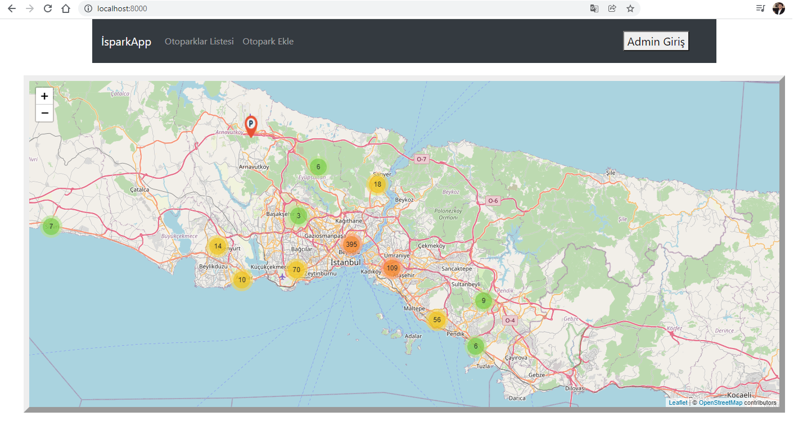

# isparkmap

*A basic car park location service for Istanbul. Related places are belongs Istanbul Metropolitan Municipality's car park service(Ispark).*    

* The project designed by MERN (MongoDB, ExpressJavaScript, React, NodeJS).
* It currently can works for localhost *(designed as port:8000(client) and port:3000(server))*
* The default datas are from Ispark Open Source Data Platform.  
* The map library is openstreetmap service as Leaflet.
* It's current language Turkish.
 

*Here you can see the main page;*

